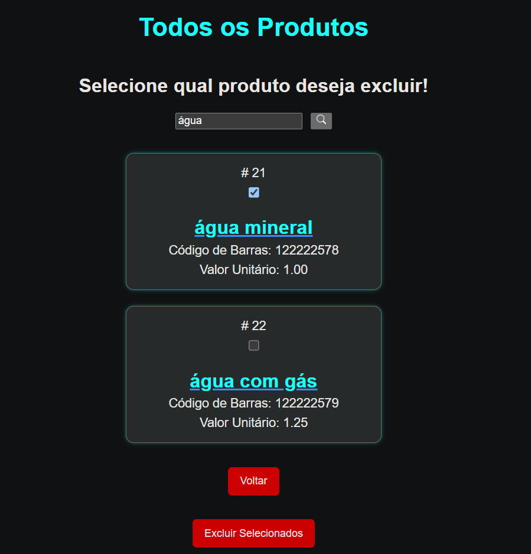

# Aplicação Web CRUD produto, cliente e pedido com framework PHP Laravel, e um banco de dados relacional MySQL.

## CRUD (create, ready, updata e delete) 3 models (produto, cliente e pedido)


- [✅] Pode Filtar qualquer item



- [✅] Pode Ver, Editar e Deletar qualquer item existente


- [✅] Possui alertas de erros e notificações de sucesso


## 📋 Pre-requsitos 

- Linguagem: [PHP](https://www.php.net/downloads.php) 
- Gerenciador de dependência: [Composer](https://getcomposer.org/)
- FrameWork: [Laravel](https://laravel.com/docs/10.x)
- BD: [Mysql](https://www.mysql.com/downloads/) (Adapte suas variaveis no seu BD)

## 🖥️ Execução do projeto

Aqui estão as instruções para configurar e iniciar o projeto:

- 1. Inicie o servidor local com sua porta padrão:

```bash
php artisan serve
```
(Certifique-se de ter o Composer instalado e todas as dependências do Laravel configuradas)

- 2. Execute as migrações para configurar o banco de dados:

```bash
php artisan migrate:fresh
```
(Isso garantirá que o banco de dados esteja configurado corretamente com as tabelas necessárias)

- 3. Execute os seeders para preencher o banco de dados com dados iniciais:

```bash
php artisan db:seed
```

(Essa etapa é importante para ter dados de exemplo no banco, facilitando o desenvolvimento e teste)

* Certifique-se de ajustar qualquer configuração adicional necessária no arquivo .env do seu projeto antes de iniciar o servidor. Se você ainda não tem um arquivo .env, pode copiar o .env.example e configurar conforme necessário.

```bash
DB_CONNECTION=mysql
DB_HOST=127.0.0.1
DB_PORT=3306
DB_DATABASE=my_database
DB_USERNAME=my_username
DB_PASSWORD=my_password
```

## 🔗 Ponto de acesso (rota)

- 1. Pagina Inicial:
```bash
    http://127.0.0.1:8000
```
- 2. Pagina de Criação:

```bash
    http://127.0.0.1:8000/produto/novo
    http://127.0.0.1:8000/cliente/novo
    http://127.0.0.1:8000/pedido/novo
```
- 3. Pagina de Visualização:

```bash
    http://127.0.0.1:8000/produtos
    http://127.0.0.1:8000/clientes
    http://127.0.0.1:8000/pedidos
```
- 4. Pagina de Edição:

```bash
    http://127.0.0.1:8000/produtos/editar
    http://127.0.0.1:8000/clientes/editar
    http://127.0.0.1:8000/pedidos/editar
```
- 5. Pagina de Exclusão:

```bash
    http://127.0.0.1:8000/produtos/excluir
    http://127.0.0.1:8000/clientes/excluir
    http://127.0.0.1:8000/pedidos/excluir
```
## 🔧 teste Unitário

- acesse:
```bash
    php artisan test
```
## Que bom que chegou até o final!

- Em caso de duvidas:
    contatomarlisson@gmail.com


